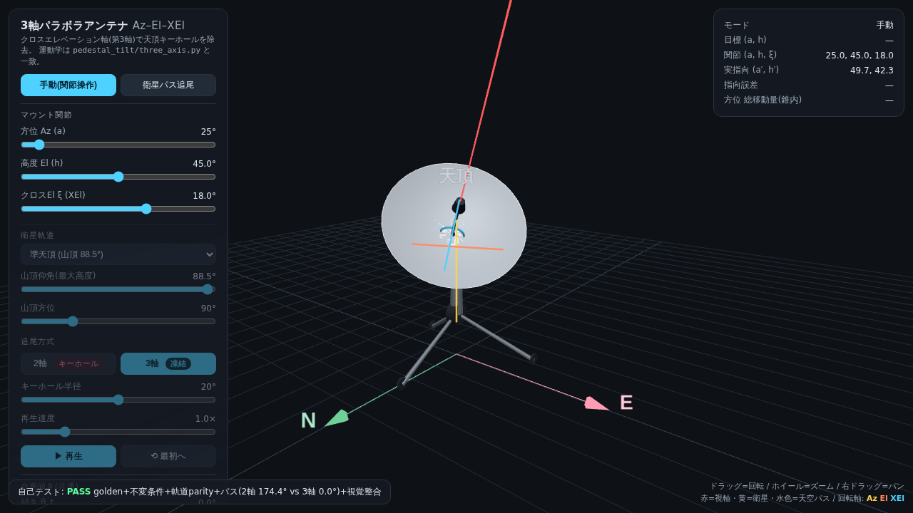
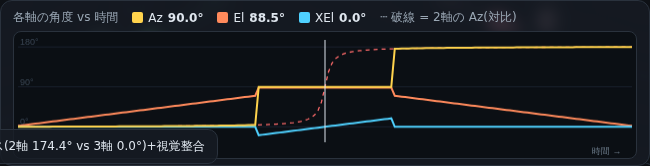
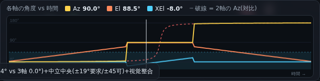
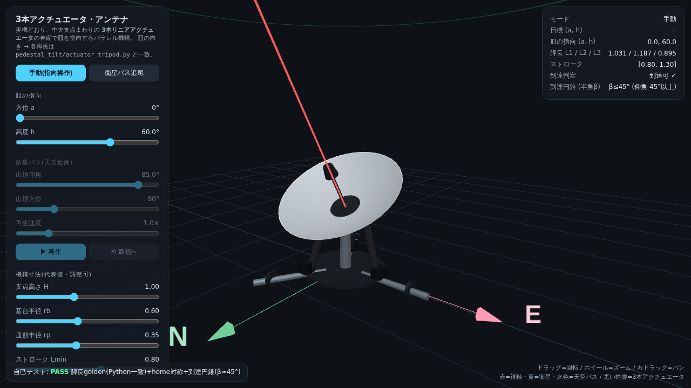

# parabolic-antenna

パラボラアンテナ(望遠鏡)の指向に関する一連のツールと可視化:

1. **台座傾き推定・太陽指向補正** — 3 観測点(9時/12時/15時の太陽撮影)から台座の傾き (θ_t, φ_t) を推定し、太陽を像中央に置く指令補正を行う(本来の課題)。
2. **3軸(Az–El–XEl)マウント** — 2軸経緯台の天頂キーホール(方位 180° スピン)を第3軸(クロスエレベーション)で除去する運動学。関節可動域・第3軸の中立位置の扱いも含む。
3. **実機の3本リニアアクチュエータ機構** — 写真の実機(中央支点＋3本シリンダのパラレル機構)の逆運動学と到達範囲(ワークスペース円錐)。
4. **インタラクティブ 3D シミュレーション** — 上記をブラウザで操作・可視化(`sim/`、Three.js)。

コアは Python 標準ライブラリのみ(外部依存なし)。詳細な数式・導出・解答は **[REPORT.md](./REPORT.md)** を参照。

## ファイル構成

```
parabolic-antenna/
├── REPORT.md                       # 数式・導出・解答・コード解説
├── 3D補正.xlsx                     # 元の問題ファイル
├── pedestal_tilt/
│   ├── __init__.py
│   ├── geometry.py                 # 順問題・像ずれ・補正(numpy 不要)
│   ├── solver.py                   # 最小二乗で (θ_t, φ_t) 推定
│   ├── three_axis.py               # 3軸(Az–El–XEl)運動学・キーホール除去・関節可動域
│   ├── actuator_tripod.py          # 実機の3本リニアアクチュエータ(パラレル機構)運動学
│   └── sun.py                      # 観測地・日時 → 太陽の方位/高度(NOAA/Meeus, stdlibのみ)
├── examples/
│   ├── demo.py                     # 本問題のサンプル実行
│   ├── demo_3axis.py               # 天頂キーホール除去・第3軸の中立位置デモ
│   └── demo_sun.py                 # 太陽位置の厳密計算 → 傾き推定パイプライン
├── tests/
│   └── test_pedestal_tilt.py       # 単体テスト(stdlib unittest)
├── sim/
│   ├── antenna3d.html              # 3軸(Az–El–XEl)マウントのインタラクティブ3Dシミュレーション
│   ├── tripod3d.html               # 実機準拠:3本アクチュエータ機構の3Dシミュレーション
│   └── gen_golden.py               # シムの自己テスト golden 値を再生成
└── slides/
    ├── slides.html                 # 解説スライド(HTML)
    └── pedestal-tilt-explained.pptx # 解説スライド(PowerPoint)
```

## 動作環境

- Python 3.10+
- コア(`pedestal_tilt/`・`examples/`・`tests/`)は標準ライブラリ(`math`, `dataclasses`, `datetime`, `unittest`)のみ。外部依存なし。
- 3D シミュレーション(`sim/*.html`)はブラウザで動作。Three.js を CDN から読み込むためインターネット接続が必要(ファイルを直接開けば可、サーバ不要)。

## 使い方

### デモ実行

```bash
python3 examples/demo.py
```

出力例:
```
=========================================================
 台座傾き推定
=========================================================
  θ_t = 0.7071°  (傾きの大きさ)
  φ_t = 315.00°  (傾きの方位 — 北=0, 東=90, 南=180, 西=270)
  → 台座は NW 方向に約 0.71° 倒れている

=========================================================
 補正値(各時刻の太陽を像中央に置くための指令値)
=========================================================
    9時 | ( 90.000°, 30.000°) | ( 90.289°, 29.500°)
   12時 | (180.000°, 70.000°) | (178.626°, 69.500°)
   15時 | (270.000°, 30.000°) | (269.711°, 30.500°)
```

### テスト実行

```bash
python3 -m unittest tests.test_pedestal_tilt -v
```

### ライブラリとして使う

```python
from pedestal_tilt import Observation, fit_tilt, correction

# 観測データ:太陽の真位置と像でのずれ
observations = [
    Observation(a_sun_deg=90.0,  h_sun_deg=30.0, dh_image_deg=-0.5),
    Observation(a_sun_deg=180.0, h_sun_deg=70.0, dh_image_deg=-0.5),
    Observation(a_sun_deg=270.0, h_sun_deg=30.0, dh_image_deg=+0.5),
]

# 台座傾きを推定
theta, phi, residuals = fit_tilt(observations)
print(f"傾き: θ={theta:.3f}°, 方位 φ={phi:.1f}°")

# 任意の真位置に対する指令補正
a_cmd, h_cmd = correction(a_calc_deg=180.0, h_calc_deg=70.0,
                          theta_t_deg=theta, phi_t_deg=phi)
print(f"指令値: ({a_cmd:.3f}°, {h_cmd:.3f}°)")
```

### 太陽位置を厳密に求める

太陽の真位置 (方位, 高度) を観測地・日時から計算する(NOAA/Meeus 系、**標準ライブラリのみ**、
誤差 ~0.01° 級)。傾き推定の観測値づくりに使える。

```python
from datetime import datetime, timezone, timedelta
from pedestal_tilt import sun_altaz

JST = timezone(timedelta(hours=9))
az, el = sun_altaz(lat_deg=35.681, lon_deg=139.767,        # 東京
                   when_utc=datetime(2024, 3, 20, 12, 0, tzinfo=JST))
# → 方位 184.98°, 高度 54.23°(大気差込みの「見かけ」位置)
```

- 方位=北0/東90、高度=地平0/天頂90。`when_utc` は tz 付きなら UTC へ自動変換(naive は UTC とみなす)。
- `refraction=False` で大気差を除いた幾何学的真位置。`delta_t_s=` で ΔT(=TT−UT)を上書き可。
- `python3 examples/demo_sun.py` で「厳密太陽位置 → `fit_tilt` で傾き復元」の一連を実演。

## 物理モデル(要約)

台座傾きを (θ_t, φ_t) と置くと、太陽の真位置 (a_sun, h_sun) を指令したときの像ずれは線形近似で:

```
Δh_image       = +θ_t · cos(a_sun − φ_t)
Δa·cos(h)_image = +θ_t · sin(a_sun − φ_t) · sin(h_sun)
```

像中央に太陽を置くための指令補正:

```
h_cmd = h_calc + θ_t · cos(a_calc − φ_t)
a_cmd = a_calc + θ_t · sin(a_calc − φ_t) · tan(h_calc)
```

導出と検証は [REPORT.md](./REPORT.md) を参照。

## 3軸(Az–El–XEl)マウント — 天頂キーホール除去

2軸(高度 0–90°)では天頂近傍を追尾する際に方位をほぼ 180° 振る必要があり(キーホール)、
補正式の `tan(h)` も天頂で発散する。最上部にクロスエレベーション軸 ξ を1つ足すと、
方位を凍結したまま視軸を横へ倒して天頂を「またいで」追尾できる。

```bash
python3 examples/demo_3axis.py
```

```python
from pedestal_tilt import forward_3axis, ik_3axis_hold, plan_pass

# 順問題:ξ=0 なら従来の 2軸 forward_pointing と厳密一致(上位互換)
a_act, h_act = forward_3axis(a_cmd=90.0, h_cmd=89.0, xel_cmd=1.0,
                             theta_t_deg=0.0, phi_t_deg=0.0)

# 逆問題:方位を a_hold に凍結したまま目標を狙う(キーホール除去の中核)
a, h, xel = ik_3axis_hold(a_tgt=120.0, h_tgt=89.5, a_hold=90.0,
                          theta_t_deg=0.0, phi_t_deg=0.0)

# パス全体の関節指令列を生成(キーホール内は方位保持戦略)
commands = plan_pass(sky_samples, theta_t_deg=0.0, phi_t_deg=0.0,
                     keyhole_deg=20.0, strategy="3axis")
```

最接近 1° の天頂通過パスでの実測:**キーホール内の方位総移動量は 2軸 174° → 3軸 0.00°**
(XEl 最大 19.5°、指向誤差 < 1e-12°)。詳細は [REPORT.md](./REPORT.md) §8。

### 3D シミュレーション

`sim/antenna3d.html` をブラウザで開くと、3軸マウントをインタラクティブに操作できる
(Three.js, 外部サーバ不要・ファイルを直接開いて可)。



- **手動モード**: Az / El / XEl と台座傾き θ_t/φ_t をスライダー操作。実指向 (a′,h′) は `forward_3axis` と一致(起動時に自己テストで検証)。
- **衛星パス追尾モード**: あらゆる軌道パターンをプリセット＋スライダーで指定 ——
  直上通過(天頂)/準天頂/高・中・低仰角/極軌道 N→S/赤道 E→W/静止衛星 GEO、
  および山頂仰角・山頂方位の自由調整。2軸(キーホール)と 3軸(方位凍結+XEl)を切替比較。
- **3軸の角度 vs 時間グラフ**: 横軸=時間で **Az(黄)/El(橙)/XEl(水)を同時表示**。
  3軸では Az が山頂で平坦凍結・XEl が天頂越えを肩代わり、破線(2軸 Az)が急上昇する対比を可視化。
- **回転軸の3D表示**: 各関節の回転軸(Az=鉛直・El=トラニオン水平・XEl=傾斜)を皿の手前に色分け描画。
- **関節可動域 / 第3軸の中立位置**: XEl の中立を「端 [0–90°]」か「中央 [−45–+45°]」で切替。同じ 90° 幅でも、**中立を中央に置けば天頂越えの ±ξ が収まりキーホール除去が成立**(端では負側がはみ出し ⚠超過)。グラフに可動域バンド、読み出しに範囲内✓/超過⚠ を表示。





運動学 JS は `pedestal_tilt/three_axis.py` の厳密移植。数式を変えたら
`python3 sim/gen_golden.py` で自己テストの golden 値(`GOLD_FWD`/`GOLD_HOLD`/`GOLD_ORBIT`)を再生成して貼り替える。

## 実機の機構 — 3本リニアアクチュエータ(パラレル機構)

写真の実機は Az–El–XEl の回転ジンバルではなく、**中央支点まわりに張った3本の可変長
アクチュエータ(蛇腹シリンダ)の伸縮**で皿を指向する**パラレル機構**。
皿の向き (a, h) から各脚長 Lᵢ を求める逆運動学を `pedestal_tilt/actuator_tripod.py` で提供する。

```python
from pedestal_tilt import leg_lengths, reachable, max_zenith_distance, TripodGeometry

L1, L2, L3 = leg_lengths(a_deg=0.0, h_deg=70.0)     # 指向 → 3脚長(逆運動学)
ok = reachable(0.0, 30.0)                            # ストローク内で実現可能か
beta = max_zenith_distance()                         # 到達円錐の半角(全方位で届く天頂距離)
```

- **回転ジンバルの「天頂キーホール」は持たない**。代わりに到達範囲が**天頂まわりの円錐(cap)**に限られる(各脚のストロークで決まる)。全方位 360° は脚長配分で届くが、低仰角はストロークで頭打ち。代表寸法では**仰角 45° 以上・全方位**が到達範囲。
- 3D シミュレーション `sim/tripod3d.html` で、皿の指向に合わせて**3本のアクチュエータが実際に伸び縮みする**様子、**脚長 L1/L2/L3 vs 時間グラフ**(ストローク帯・超過フラグ)、**到達円錐**を確認できる(寸法はスライダーで調整可)。



## ライセンス

未指定(問題課題のため)。
